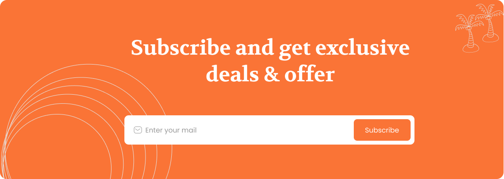

# ✈️ Trabook — Travel Booking Landing Page

A fully responsive, pixel-perfect **Travel Booking Landing Page** built with pure **HTML** and **CSS**. Experience smooth animations, interactive carousels, and a modern glassmorphism design that brings your travel dreams to life.

---

## 🌐 Live Demo

🔗 **[View Live Site](#)** _(Add your deployment link here)_

---

## 📸 Preview

### 🏠 Hero Section
- Animated gradient background with floating travel icons
- Bold call-to-action with custom search box
- Smooth scroll navigation with active states
- Responsive character illustration

### 🎯 Key Features Showcase
- Interactive service cards with hover effects
- Icon-based feature highlights
- Clean, modern card layouts

### 💳 Exclusive Deals
- Grid-based deal cards with images
- Hover animations with shadow effects
- Responsive card layouts

### 🗺️ Vacation Plans
- Tree-structured plan visualization
- Animated card interactions
- Step-by-step travel planning guide

### 💬 Testimonials
- CSS-only carousel with smooth transitions
- Avatar images positioned above cards
- Arrow navigation with hover glow effects
- Active/inactive card scaling animations

### 📝 Latest Blog
- Image-based blog cards with metadata
- Pagination dots with hover states
- Date and title formatting

### 📧 Subscribe Section
- Overlay form on background image
- Email icon integration
- Rounded subscribe button

### 🔗 Footer
- Multi-column link organization
- Social media icons with hover lift effects
- Copyright and terms section

---

## 🎮 How to Use

| Step | Action |
| :--- | :--- |
| 1️⃣ | Navigate using the **smooth-scrolling menu** (Home, About, Destination, Tour, Blog) |
| 2️⃣ | Enter **Location**, **Date**, and **Guest** details in the search box |
| 3️⃣ | Browse **exclusive deals** and **vacation plans** with hover effects |
| 4️⃣ | Read **customer testimonials** using arrow navigation (← →) |
| 5️⃣ | Explore the **latest blog posts** with pagination |
| 6️⃣ | **Subscribe** to the newsletter for exclusive offers |
| 7️⃣ | Connect via **social media** icons in the footer |

---

## ✨ Features

- 🎨 **Pixel-Perfect Design** — Matches Figma design specifications exactly
- 🖼️ **Figma Assets** — All images exported directly from Figma design files
- 📱 **Fully Responsive** — Optimized for Desktop, Tablet, and Mobile devices
- 🎭 **CSS-Only Carousel** — Testimonials slider with checkbox toggle (no JavaScript)
- 🔄 **Smooth Animations** — Card hovers, button effects, and scroll behavior
- 🎯 **Interactive Elements** — Hover states, active navigation, and form overlays
- 🌈 **Modern UI** — Glassmorphism effects, gradients, and shadow layers
- ⚡ **Fast Loading** — Pure HTML/CSS with optimized images
- 🔗 **Smooth Scroll** — Navigation links scroll smoothly to sections
- 🎨 **Custom Typography** — Poppins and Volkhov font families
- 🧭 **Section Navigation** — ID-based anchor links for easy navigation

---

## 🛠️ Tech Stack

| Technology | Purpose |
| :--- | :--- |
|  | Semantic structure and layout |
|  | Styling, animations, and responsive design |
|  | Design source and asset export |

---

## 📁 Project Structure

```text
Trabook-Landing-Page/
│
├── index.html                  # Main HTML structure
├── style.css                   # All styles and animations
├── README.md                   # Project documentation
│
├── images/                     # Figma exported assets
│   ├── hero-character.png
│   ├── best vacation plan tree.png
│   ├── Deals & discounts Card-1.png
│   ├── Vacation plan Card-1.png
│   ├── review image.png
│   ├── man.png
│   ├── blog 1.png
│   ├── Subscribe.png
│   ├── Email.png
│   ├── Social Facebook.png
│   ├── Social Instagram.png
│   ├── Social twitter.png
│   └── Vector.png
│
└── Documentation/
    ├── DEPLOYMENT_CHECKLIST.md
    ├── FIGMA_EXPORT_GUIDE.md
    ├── WEBSITE_SECTIONS.md
    └── QUICK_START.md
```

---

## ⚙️ Setup & Installation

1. **Clone the repository:**
   ```bash
   git clone https://github.com/yourusername/trabook-landing-page.git
   ```

2. **Navigate into the folder:**
   ```bash
   cd trabook-landing-page
   ```

3. **Open index.html in your browser:**
   - Double-click the file, OR
   - Right-click → Open with → Chrome/Firefox, OR
   - Use the Live Server extension in VS Code

✅ **No build tools, dependencies, or JavaScript frameworks required!**

---

## 🎨 Design System

### Color Palette

| Color | Hex | Usage |
| :--- | :--- | :--- |
| 🟠 **Primary Orange** | `#FF7757` | Buttons, highlights, active states |
| ⬛ **Dark Text** | `#222222` | Headings and primary text |
| 🔘 **Gray Text** | `#666666` | Secondary text and descriptions |
| ⬜ **Light Gray** | `#F7F7F7` | Backgrounds and card fills |
| 🟡 **Beige** | `#FEFAF5` | Testimonials section background |
| ⚪ **White** | `#FFFFFF` | Cards, buttons, and overlays |
| 🔵 **Light Gray** | `#B8B8B8` | Blog dates and subtle text |

### Typography

| Font Family | Usage | Weights |
| :--- | :--- | :--- |
| **Poppins** | Body text, buttons, navigation, forms | 400, 500, 600, 700 |
| **Volkhov** | Section headings and titles | 700 (Bold) |

---

## 📱 Responsive Breakpoints

| Device | Screen Width | Layout Adjustments | Status |
| :--- | :--- | :--- | :--- |
| 🖥️ **Desktop** | `> 1024px` | Full multi-column layout | ✅ |
| 💻 **Laptop** | `768px - 1024px` | Adjusted spacing and columns | ✅ |
| 📱 **Tablet** | `480px - 768px` | Stacked cards, single column | ✅ |
| 📱 **Mobile** | `< 480px` | Full-width elements, vertical stack | ✅ |

---

## 🎭 Key Sections

### 1. Navigation Bar
- Sticky positioning with smooth scroll
- Active link highlighting
- Login and Sign Up buttons with hover effects

### 2. Hero Section (`id="home"`)
- Large heading with gradient text
- Character illustration
- Search box with Location, Date, and Guest inputs
- Orange search button with hover animation

### 3. Things You Need Section (`id="about"`)
- Three service cards with icons
- Sign Up, Money, and Travel features
- Hover effects with shadow lift

### 4. Exclusive Deals Section (`id="destination"`)
- Grid of 4 deal cards with images
- Card hover animations
- Responsive grid layout

### 5. Best Vacation Plan Section (`id="tour"`)
- Tree diagram visualization
- Three vacation plan cards
- Interactive hover states

### 6. Testimonials Section
- CSS-only carousel using checkbox toggle
- Active card: 420px wide, positioned at top
- Inactive card: scaled down, positioned below right
- Avatar images above cards
- Arrow button navigation (← →)
- Smooth slide animations

### 7. Blog Section (`id="blog"`)
- 4 blog cards with images
- Title and date metadata
- 3-dot pagination with hover states

### 8. Subscribe Section
- Background image with overlay form
- Email icon inside input field
- 555px form width with white border
- Rounded subscribe button

### 9. Footer
- 4-column layout (Logo, Company, Contact, More)
- 60px social media icons with hover lift
- Terms & Conditions link
- Copyright notice

---

## 🎬 Animations & Effects

### Hover Effects
- **Cards**: Shadow lift and scale transform
- **Buttons**: Background color transition and glow
- **Social Icons**: Slight upward lift
- **Navigation Dots**: Color change to orange

### Carousel Animation
- **Active Card**: Full opacity, top position, scale(1)
- **Inactive Card**: Reduced opacity, bottom-right position, scale(0.9)
- **Transition**: Smooth transform with 0.5s ease
- **Navigation**: Arrow buttons with orange glow on hover

### Scroll Behavior
- **Smooth Scroll**: CSS `scroll-behavior: smooth` for anchor links
- **Section Navigation**: Instant scroll to #home, #about, #destination, #tour, #blog

---

## 🔧 CSS Techniques Used

- **Flexbox** — Navigation, cards, and form layouts
- **Grid** — Deal cards and vacation plan layouts
- **CSS Variables** — Color scheme management
- **Pseudo-elements** — Decorative effects and overlays
- **Transform & Transition** — Smooth animations
- **Position Absolute** — Overlay forms and decorative elements
- **Checkbox Hack** — CSS-only carousel toggle
- **Media Queries** — Responsive breakpoints

---

## 🚀 Deployment

This project can be deployed on any static hosting platform:

| Platform | Deployment Method |
| :--- | :--- |
| 🌐 **Netlify** | Drag & drop or Git integration |
| 🔷 **Vercel** | Import from GitHub |
| 📄 **GitHub Pages** | Enable in repository settings |
| 🔥 **Firebase Hosting** | `firebase deploy` |

---

## 📝 Key HTML Structure

### Navigation
```html
<nav class="navbar">
  <ul>
    <li><a href="#home">Home</a></li>
    <li><a href="#about">About</a></li>
    <li><a href="#destination">Destination</a></li>
    <li><a href="#tour">Tour</a></li>
    <li><a href="#blog">Blog</a></li>
  </ul>
</nav>
```

### Testimonials Carousel
```html
<input type="checkbox" id="testimonial-toggle">
<div class="testimonial-wrapper testimonial-wrapper-1">
  
  <div class="testimonial-card">...</div>
</div>
<label for="testimonial-toggle">←</label>
<label for="testimonial-toggle">→</label>
```

### Subscribe Form Overlay
```html
<div class="subscribe-box">
  
  <div class="subscribe-overlay">
    <div class="subscribe-form">
      
      <input type="email" placeholder="Enter your mail">
      <button class="subscribe-btn">Subscribe</button>
    </div>
  </div>
</div>
```

---

## 🎯 Design Principles

- **Pixel-Perfect** — Matches Figma design specifications exactly
- **Consistency** — Uniform spacing, colors, and typography
- **Accessibility** — Semantic HTML and proper alt attributes
- **Performance** — Optimized images and minimal CSS
- **Maintainability** — Clean code structure and comments
- **Responsiveness** — Mobile-first approach with breakpoints

---

## 📄 License

This project is open-source and available under the **MIT License**.

---

## 👨‍💻 Author

**Your Name**  
🔗 [GitHub](https://github.com/yourusername)  
🔗 [LinkedIn](https://linkedin.com/in/yourusername)  
🔗 [Portfolio](https://yourportfolio.com)

---

## 🙏 Acknowledgments

- Design inspiration from Figma community
- Font families from Google Fonts (Poppins, Volkhov)
- Icons and images exported from Figma design files

---

## 📞 Support

If you have any questions or need help with the project:

- 📧 Email: your.email@example.com
- 💬 Open an issue on GitHub
- 🐦 Twitter: @yourusername

---

**⭐ If you like this project, please give it a star on GitHub!**
